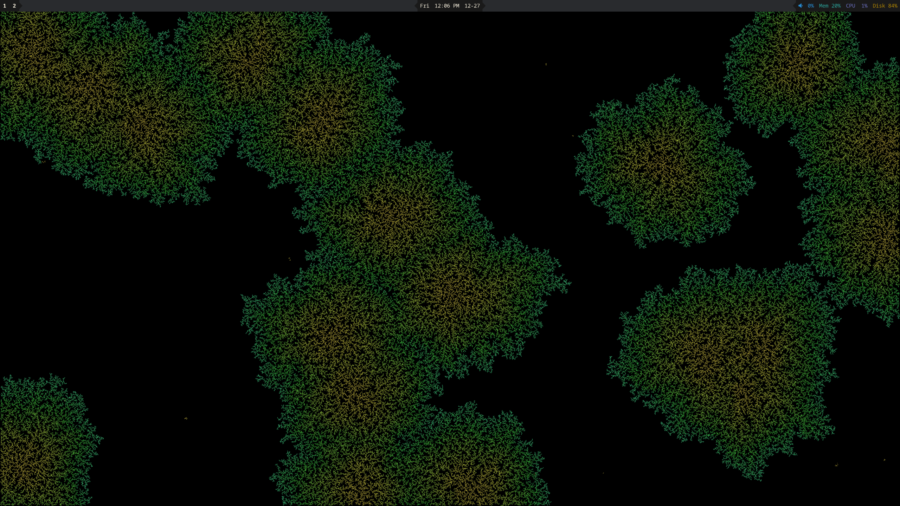

+++
title = "xscreensaver"
date = "2024-12-27"
tags = [
    "linux",
]
+++

[xscreensaver](https://www.jwz.org/xscreensaver/) is a collection of free screen savers that has been slowly accumulating for 30+ years. Originally written using low level X11 calls, it was later ported to macOS, iOS, and Android via a XLib compatibility layer.

I've been actively disabling screensavers on computers for as long as I can remember to save power. I've never actually experienced the [many animations](https://www.jwz.org/xscreensaver/screenshots/) from xscreensaver until this week.

I find these animations to be super cool because they are entirely programmatically generated and are different every invocation. Many are actually interactive and allow the user to reset the animation state by pressing enter.

However, as a committed [sway/wayland user](https://github.com/gartnera/.linux-config) it wasn't actually possible to easily view the animations on my system. When running `xscreensaver`, the program just exits with a failed assertion about running on X11. jwz (the main author) has a few blog posts about wayland ([1](https://www.jwz.org/blog/2023/09/wayland-and-screen-savers/) and [2](https://www.jwz.org/blog/2023/11/the-war-on-screen-savers-continues-apace/)).

## xscreensaver-run

I discovered [xscreensaver-run](https://github.com/sergei-mironov/xscreensaver-run) which allows you to run a screensaver program without all the screen locking stuff. The only problem was that it was entirely broken by default and would exit with ANY input. I wrote a [small patch](https://github.com/gartnera/xscreensaver-run/commit/0cca0688fc50afd86de6aee2ce7a99ffac437b59) which would only exit if the escape key was pressed. This allows you to interact with screensaver program.

I then used this bash one-liner to run a random screensaver until you forcibly close the window (ALT+F4):


```bash
while ./xscreensaver-run -v -- "$(find /usr/lib/xscreensaver/ -type f | grep -v xscreensaver- | shuf -n 1)"; do :; done
```

There are two remaining problems:
- the screen flashes briefly before the next screensaver is shown
- X11 windows are [forcibly scaled by sway](https://github.com/swaywm/sway/issues/1047) which results in blurriness

### Screen Flashes

Reading the `xscreensaver-run` source, it creates a root window then provides that window ID to the screensaver program. It stands to reason that the screensaver program just takes over that window. So theoretically you could just reuse the same root window multiple times so long as you cleanly stopped the previous screensaver program.

That's exactly what I did in my next [xscreensaver-run](https://github.com/gartnera/xscreensaver-run/commit/98a8a8620ba7d0b082253e2463bcfe4a22a6c060) patch. `xscreensaver-run` now loads a list of screensavers from a file and runs them sequentially. You can also provide arguments to each screensaver. Many allow you to tune animations speed and other parameters.

### sway High DPI

Much like with [games](https://github.com/gartnera/.linux-config/blob/cc8474975f5e8450b550922e0a08ec1f64de1033/scripts-bin/game-wrapper), I also added a small [gamescope](https://github.com/gartnera/xscreensaver-run/blob/master/gamescope-wrapper) wrapper to allow the screensaver to run at full resolution.

This workaround is not needed on KDE and Hyprland as they allow you to opt out of X11 window scaling.

## wscreensaver

I also discovered [wscreensaver](https://git.sr.ht/~mstoeckl/wscreensaver) which allows you to use some xscreensaver animations on your screen locker. The upstream instructions aren't terribly clear, so here are mine:

```bash
git clone 'https://git.sr.ht/~mstoeckl/wscreensaver'
cd wscreensaver
./configure
make
mkdir build
cd build
meson ../wayland
ninja
```

The output will be a bunch of individually runnable screensaver programs. If you run these programs outside of a screen locker, it will render to your desktop wallpaper:



mstoeckl (the author) also has a [swaylock fork](https://github.com/mstoeckl/swaylock-plugin) which allows you to run the screensaver programs on your lock screen. I installed it on arch linux with `yay -S swaylock-plugin-git`. 

Run the screenlocker with `swaylock-plugin --command-each ./xscreensaver-bubble3d`



`swaylock` uses pam by default which requires a [configuration file](https://github.com/mstoeckl/swaylock-plugin/blob/fdade0d37707f75fc59c8c933d4b7ff029e1c3f3/pam/swaylock-plugin) to be installed. I was stuck on this for awhile when developing my personal [swaylock fork](https://github.com/gartnera/swaylock).
